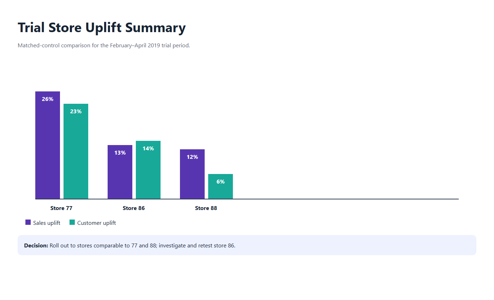

# Quantium Retail Analytics

[](https://github.com/fetachino/quantium-retail-analytics/actions/workflows/tests.yml)

End-to-end retail analytics case study covering customer segmentation, category strategy, matched-control experimentation, uplift testing, and executive communication.

This project was completed as part of the Quantium Data Analytics virtual experience. It demonstrates how transaction data can be translated into practical recommendations for a category manager—not simply summarized in charts.

## Executive summary

The analysis identified three commercially actionable findings:

1. **Target Mainstream young singles and couples for growth.** This segment is a major sales pool, pays a higher average price per unit, and over-indexes toward brands including Tyrrells and Twisties.
2. **Protect high-volume family shoppers.** Young and older families purchase more units per customer, making value bundles more suitable than broad category discounting.
3. **Scale the trial selectively.** Matched-control analysis supports rollout in stores resembling trial stores 77 and 88. Store 86 attracted more customers, but its sales response was not consistently material and should be investigated before retesting.

## Business questions

- Which customer segments contribute most to chip sales?
- Are segment sales driven by customer count, purchase volume, or unit price?
- Which brands and pack sizes over-index among the target segment?
- Which stores provide credible controls for stores 77, 86, and 88?
- Did the new layouts generate meaningful sales uplift?
- What actions should the category manager take during the next six months?

## Project workflow

### 1. Data preparation and customer analytics

- Converted Excel serial dates and validated the observation period.
- Removed salsa products from the chip category.
- Investigated and removed a commercial-scale 200-unit buyer.
- Derived pack size, standardized brand names, and joined customer attributes.
- Measured sales, customers, units per customer, and weighted price per unit by segment.
- Used affinity analysis to compare the target segment with other chip shoppers.
- Tested whether Mainstream young and mid-age singles/couples paid a significantly higher unit price.

### 2. Experimentation and uplift testing

- Created monthly store metrics for sales, customers, transactions per customer, units per transaction, and price per unit.
- Restricted controls to stores operating throughout the full observation window.
- Ranked controls using an equal-weight composite of Pearson correlation and month-normalized magnitude similarity.
- Scaled controls to each trial store's pre-trial level.
- Evaluated February–April 2019 uplift against pre-trial variation and a commercial-materiality threshold.
- Diagnosed whether results were driven by customer growth or purchase frequency.

### 3. Commercial application

- Converted the analysis into an answer-first, Pyramid Principle presentation.
- Used action-oriented headlines, consistent visual encoding, and minimal technical jargon.
- Delivered category, customer, seasonal, and trial recommendations with next steps.

## Selected results

| Trial store | Matched control | Sales uplift | Customer uplift | Recommendation |
|---:|---:|---:|---:|---|
| 77 | 233 | +26% | +23% | Roll out to comparable stores |
| 86 | 155 | +13% | +14% | Investigate and retest |
| 88 | 237 | +12% | +6% | Roll out with monitoring |

Store 86 illustrates why uplift should not be judged from averages alone: customer growth was positive, but sales uplift was not consistently material across the trial months.



This chart is reconstructed from the selected results above. Original presentation slides are not used as README images because their classification footer makes them unsuitable for public portfolio display.

## Deliverables

- [Task 1: customer analytics report](Quantium_Task1_Initial_Findings_and_Code.pdf)
- [Task 2: experimentation and uplift report](Quantium_Task2_Experimentation_and_Uplift_Testing.pdf)
- [Task 3: executive category review](Quantium_Task3_Category_Review.pdf)
- [Editable Task 3 presentation](Quantium_Task3_Category_Review.pptx)
- [Client cover email](Task3_Cover_Email.txt)

## Repository structure

```text
├── quantium_task1_analysis.py
├── quantium_task2_analysis.py
├── build_task3_presentation.py
├── QVI_trial_results.csv
├── Quantium_Task1_Initial_Findings_and_Code.pdf
├── Quantium_Task2_Experimentation_and_Uplift_Testing.pdf
├── Quantium_Task3_Category_Review.pdf
├── Quantium_Task3_Category_Review.pptx
├── Task3_Cover_Email.txt
└── requirements.txt
```

## Technology

- Python
- pandas and NumPy
- SciPy
- Matplotlib
- python-pptx
- ReportLab
- openpyxl

## Reproducing the analysis

1. Create a Python 3.11+ environment.
2. Install dependencies:

   ```bash
   pip install -r requirements.txt
   ```

3. Obtain the Quantium Forage simulation datasets separately and place them in the locations configured at the top of each script.
4. Run the analyses in order:

   ```bash
   python quantium_task1_analysis.py
   python quantium_task2_analysis.py
   python build_task3_presentation.py
   ```

The source datasets are intentionally excluded because they are supplied for simulation use and should not be redistributed.

## Testing

The unit suite validates brand normalization, report formatting, store-similarity metrics, and matched-control selection using synthetic data. It does not require the proprietary simulation datasets.

```bash
python -m pytest
```

GitHub Actions runs the suite on Python 3.11 and 3.12 for every pull request and push to `main`.

## Analytical considerations

- Affinity measures association, not causation.
- Matched controls reduce confounding but do not replace randomization.
- The trial contains only three stores and three trial months, limiting generalizability.
- Margin, promotions, stock availability, store format, and competitor activity were unavailable.
- A wider rollout should use staged test/control deployment and track incremental revenue, margin, penetration, and repeat purchase.

## About this project

This is an independent portfolio project based on a Forage job simulation. Quantium did not review or endorse this repository. All conclusions are the author's analytical interpretation of the simulation data.
